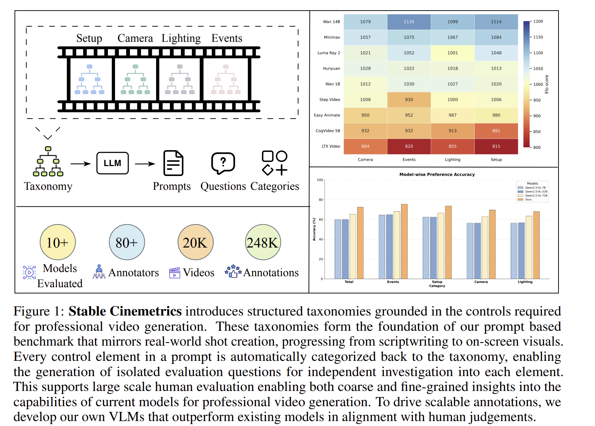

# Stable Cinemetrics
- Title: Stable Cinemetrics : Structured Taxonomy and Evaluation for Professional Video Generation
- Authors: Agneet Chatterjee, Rahim Entezari, Maksym Zhuravinskyi, Maksim Lapin, Reshinth Adithyan, Amit Raj, Chitta Baral, Yezhou Yang, Varun Jampani
- Published: NeurIPS 2025
- Paper: https://arxiv.org/abs/2509.26555
- Github: 
- Hompage: https://stable-cinemetrics.github.io/

***

## Abstract
> 최근 비디오 생성 기술의 발전으로 사용자 프롬프트로부터 고품질의 비디오 합성이 가능해졌다. 그러나 기존의 모델과 벤치마크는 **전문 영상 제작이 요구하는 복잡성과 요구 조건을 충분히 포착하지 못한다. 이러한 문제를 해결하기 위해, 본 논문에서는 영화 제작 제어 요소를 독립적이고 계층적인 Taxonomy로 정식화한 **Stable Cinemetrics(SCINE)**을 제안한다.  

> SCINE은 **Setup, Event, Lighting, Camera**의 네 가지 축으로 구성된 택소노미를 정의하며, 이는 실제 산업 관행에 기반한 **76개의 세분화된 제어 노드**로 이루어져 있다. 이 택소노미를 활용하여, **1) 전문적 사용 사례에 부합하는 프롬프트 벤치마크를 구축**하고, **2) 프롬프트 분류 및 질문 생성을 자동화하는 파이프라인을 개발함**으로써 각 제어 차원을 **독립적으로 평가**할 수 있도록 한다.  

> 또한, 10개 이상의 모델이 생성한 2만 개 이상의 비디오에 대해 **80명 이상의 영화 전문가가 참여한 대규모 인간 평가 실험을 수행**하였다. 거시적 및 미시적 분석 결과, 현재 가장 성능이 우수한 모델조차도 **특히 Events 및 Camera 관련 제어에서 상당한 격차를 보임을 확인**하였다. 확장 가능한 평가를 위해, 전문가 주석과 정렬된 **비전-언어 모델 기반 자동 평가기를 학습하였으며, 이는 기존의 제로샷 기준선보다 우수한 성능을 보인다.**  

> SCINE은 전문 영상 생성 문제를 비디오 생성 모델 연구의 맥락 안에 최초로 명확히 위치시키는 접근법으로, 영화적 제어를 중심으로 한 택소노미와 구조화된 평가 파이프라인, 그리고 향후 연구를 안내하기 위한 정밀한 분석을 함께 제시한다.

***

## 1. Introduction
+ Problem statements
    + 비디오 생성 모델 기술은 전문 영상 제작 분야에 혁신을 가져올 것이다.  
    + 생성 비전 기술은 미디어 제작에 있어 막대한 잠재력을 지니고 있지만, 여전히 근본적인 질문이 남아 있다.
    + 생성 비디오를 단순하고 탐색적인 합성 수준에서 벗어나, **전문적인 수준의 제어 가능한 영화적 결과물을 지원하는 매체로 어떻게 전환할 수 있는가**
    + **캐주얼한 생성 비디오와 전문적인 생성 비디오의 핵심적인 차이는 영화적 제어(cinematic control)의 결정적인 격차가 있다**
        > 오늘날의 모델들은 “말을 타는 우주비행사”와 같은 장면을 생성할 수는 있지만, 전문적인 제작에서는 샷의 프레이밍, 키 라이트의 위치, 심지어 우주비행사가 말이 달리기 전이나 후에 미소를 짓는지와 같은 세부적인 영화적 요소에 대한 정밀한 제어가 요구된다. 진정한 전문 비디오 생성 시스템이라면, 이러한 모든 영화적 선택을 다시 창작자의 손에 돌려주어야 한다.

+ In this paper..
    + 필수적인 영화적 제어 요소에 대한 명확한 정의
    + 비디오 생성 모델 결과에 대한 표준화된 평가 프로토콜
    + **“현재의 비디오 생성 모델은 전문적인 용도로 사용될 준비가 되었는가?”라는 질문에 직접적으로 답할 수 있도록 한다.**
    + SCINE의 핵심 목표는 생성 비전과 전문 영상 제작의 교차 영역에서, **제어(control)**와 **구체성(specificity)**의 원칙에 기반한 택소노미를 구축
    + SCINE에서 구축한 모든 원칙들은 영화 제작에서 매우 중요하며, 모든 선택은 영화적 의미를 지닌다.
        > 예를 들어, 로우 앵글(low angle)은 권력을 전달하고, 로우 키 조명(low-key lighting)은 극적인 분위기를 유발한다.

+ 
    + 그림 1은 실제 샷 제작 워크플로우를 반영한 SCINE 파이프라인을 보여주며, 이는 각본 작성 단계에서 시작해 화면상의 비주얼로 이어지는 과정을 따른다. 
    + 각 프롬프트는 SCINE 택소노미로부터 제어 요소들을 샘플링하여 구성되며, 이를 통해 다양한 전문적 사용 사례를 포괄하도록 설계된다. 
    + 프롬프트에 명시된 모든 제어 요소는 자동으로 다시 택소노미에 분류되며, 이를 기반으로 각 제어 차원에 대한 표적화된 평가 질문을 생성할 수 있다.

    + 이와 같은 구조화된 정식화는 영화적 제어 요소에 대해 독립적이며 세분화된 평가를 가능하게 하여, 단순한 전체 영상 품질 판단을 넘어 생성 모델의 구체적인 강점과 약점을 진단할 수 있도록 한다. 
    + Setup, Camera, Lighting, Events를 분리하여 평가함으로써, SCINE은 거시적인 비교뿐만 아니라 개별 제어 속성 수준의 정밀한 분석을 지원한다.

    + SCINE은 확장성을 고려하여 설계되었다. 
        + 전문 영상 품질을 평가하는 데 있어 전문가 인간 평가는 여전히 가장 신뢰할 수 있는 기준이지만, 비용이 높고 확장이 어렵다는 한계가 있다. 
        + 이러한 제약을 해결하기 위해, 본 연구에서는 전문가 주석과 정렬된 비전-언어 모델을 학습하여 자동 평가를 수행하는 방법을 추가로 탐구한다.
        + 이는 인간 판단과의 높은 상관성을 유지하면서도 확장 가능한 대안을 제공한다.
    
## 3. Proposed Methods